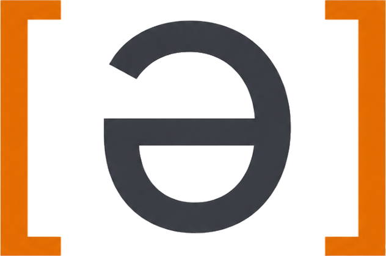

<!-- Decorative: the heading below carries the name, so alt is empty on purpose. -->


# OpenSchwa /ˈoʊpən ʃwɑː/

**Open-source phonetics practice.** · [openschwa.ru](https://openschwa.ru)

Named after the schwa — **ə** — the most common sound in English and the most
iconic symbol in phonetics. OpenSchwa helps learners actually *practice* the
sounds of a language, not just read about them.

> **Status: pre-alpha.** M0 is done — the pipeline runs end to end: record in
> the browser, get forced-aligned phones and a pitch contour back, rendered over
> a client-side spectrogram. **M1's judge line closed as a documented
> negative** — the /ð/ judge never met the bar (honest ceiling ≈ 0.7 pooled
> AUC after the speaker-leakage correction) and is parked as research. The
> milestone pivoted (owner decision, 2026-08-20) to a **mirror**: the engine
> reports what it *heard* at the focus slot — "I heard /z/ where you were
> going for /ð/" — instead of judging the learner, gated by its own exam
> (hearing accuracy ≥ 0.90 at coverage ≥ 0.4). The ear is examined in
> `eval/reports-mirror/`; until it passes, the engine still reports
> measurements only — **no feedback beats wrong feedback.** Full story:
> [docs/architecture.md](docs/architecture.md),
> [docs/research/mirror-pivot-2026-08.md](docs/research/mirror-pivot-2026-08.md),
> and [eval/reports/](eval/reports/).

## 🎯 What it does (when it's done)

Personalized pronunciation feedback on scripted drills, three ways:

1. **Segments** — "this sounded more like *zis* than *this*", anchored to the
   exact stretch of audio, shown only when the engine is confident;
2. **Intonation** — your pitch contour against the teacher's
   ("please." / "please?" / "please!");
3. **Annotated spectrograms** — aspiration and devoicing marked *on* the
   spectrogram, not left for you to find.

The core promise: **no feedback beats wrong feedback.** Every judgment is
confidence-gated, and a feedback type ships only after offline evaluation on
L2 speech corpora proves its precision — the bar is spelled out in
[eval/README.md](eval/README.md).

## 🏗️ Architecture in one paragraph

A local **Python engine** (FastAPI; forced alignment + GOP scoring +
closed-set contrast discrimination, Praat-based prosody) talks to a
**TypeScript UI** (Vite + Svelte; recording, spectrogram and pitch rendering)
over a versioned localhost API. Inference is fully local and CPU-friendly.
The same two pieces later become a **Tauri desktop app** and, eventually, a
hosted web service — packaging changes, not rewrites.

Two guides, depending on who's reading: [for coders](docs/architecture.md) ·
[for linguists and non-coders](docs/architecture-for-linguists.md).

## 🗺️ Roadmap

- **M0** ✅ — walking skeleton: record → align → render phones + pitch
- **M1** ✅ — eval harness + contrast scoring + calibration pipeline; the
  /ð/ **judge** line ended as a **documented negative** (speaker-leakage
  corrected, honest ceiling ≈ 0.7 pooled AUC, bar not met, no verdicts ship)
  — see [eval/reports/](eval/reports/) and
  [docs/architecture.md](docs/architecture.md). **Pivoted (2026-08-20) to the
  mirror**: the engine reports what it heard instead of judging —
  [docs/research/mirror-pivot-2026-08.md](docs/research/mirror-pivot-2026-08.md);
  models & data research for the ear:
  [docs/research/models-and-data-post-m1.md](docs/research/models-and-data-post-m1.md)
- **M2** — intonation: nuclear-tone verdicts + DTW contour overlay, gated by
  its own bar (≥ 90% fall-vs-rise on a purpose-recorded set)
- **M3** — annotated spectrograms (VOT, voicing)
- **M4** — desktop app (Tauri)

## 🛠️ Development

```bash
just setup   # engine deps (with the ML extra) + UI deps
just models  # download the alignment model (~1.3 GB, resumable, cached outside the repo)
just dev     # engine (uv) + UI (npm) together -> http://localhost:5173
just test    # tests, lint, typecheck, schema-drift gates
just schema  # regenerate contract artifacts after editing the pydantic models
```

Requires [uv](https://docs.astral.sh/uv/), Node 22+, and
[just](https://github.com/casey/just).

To build a double-clickable app for the machine you are on:

```bash
just package              # ~590 MB unsigned bundle, built for this platform only
./dist/openschwa/openschwa
```

It serves its own UI and opens a browser at it. Cross-platform, signed
installers are M4 — see [engine/packaging/README.md](engine/packaging/README.md).

Everything runs on your machine. Recordings are never uploaded anywhere, and
the app works offline once the model is cached. You can skip `just models` and
still browse drills and see your own audio measured — the engine simply says it
cannot judge, which is the behaviour the whole design is built around.

## 💡 Why "OpenSchwa"?

- **Open** — open source (AGPL-3.0), openly built, and open to contributors.
- **Schwa** — /ə/ is where English phonetics begins: the unstressed heart of
  the language, hiding in *about*, *banana*, and *the*. If you can hear and
  produce the schwa, you're already practicing phonetics.

Spelled the standard dictionary way — "schwa", not the rare variant "shwa" —
for searchability and credibility with a phonetics-literate audience.

## 📜 License

[AGPL-3.0](LICENSE) — free to use, modify, and share; anyone offering a
modified version as a service must share their source. The network copyleft is
the point rather than an accident: it is what keeps a hosted commercial fork
from closing up. The trade-off — friction for companies allergic to copyleft —
was weighed and accepted. OpenSchwa is an educational community project, not a
maximum-adoption library, and adoption is not on its own a reason to relicense.

Third-party models and corpora keep their own licences and are not AGPL
OpenSchwa source — see
[the committed vocabularies](engine/src/openschwa_engine/models/vocab/README.md).
The licence for teacher-recorded reference audio is still open; the proposal is
CC BY-SA 4.0 ([docs/architecture.md](docs/architecture.md) §9).
